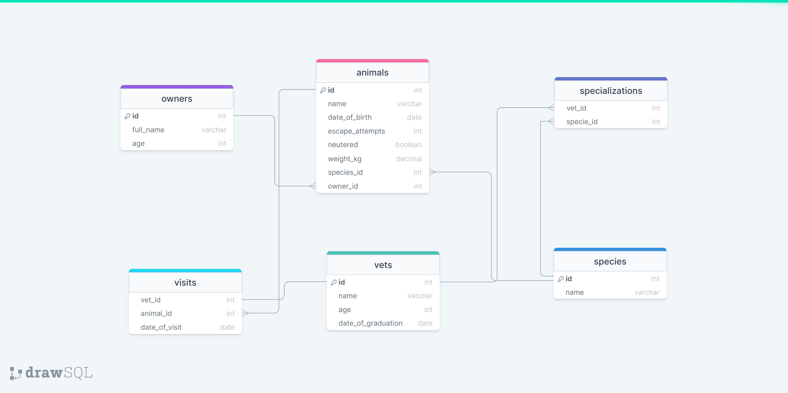

# Vet Clinic Database

Relatonal Database is used to create the data structure for a Vet_Clinic;





## Getting Started

To setup the project locally: clone the repository using:

```
git clone https://github.com/developerwaleed/Vet-Clinic-DB.git
```

## Authors


## 🤝 Contributing

Contributions, issues, and feature requests are welcome!

Feel free to check the [issues page](../../issues/).

## Show your support

Give a ⭐️ if you like this project!
# Vet Clinic Database

Relatonal Database is used to create the data structure for a Vet_Clinic;


## Getting Started

To setup the project locally: clone the repository using:

```
git clone git@github.com:ha-manel/Vet-Clinic-DB.git
```

## Authors

| 👤 Name | Github | Twitter | LinkedIn |
|------|--------|---------|----------|
|Waleed Amjad|[@caasperr](https://github.com/developerwaleed)|[@developerwaleed](https://twitter.com/developerwaleed)|[@developerwaleed](https://www.linkedin.com/in/developerwaleed/)|
|Shahnawaz Ali|[@shahnawaza75](https://github.com/shahnawaza75)|

## 🤝 Contributing

Contributions, issues, and feature requests are welcome!

Feel free to check the [issues page](../../issues/).

## Show your support

Give a ⭐️ if you like this project!
